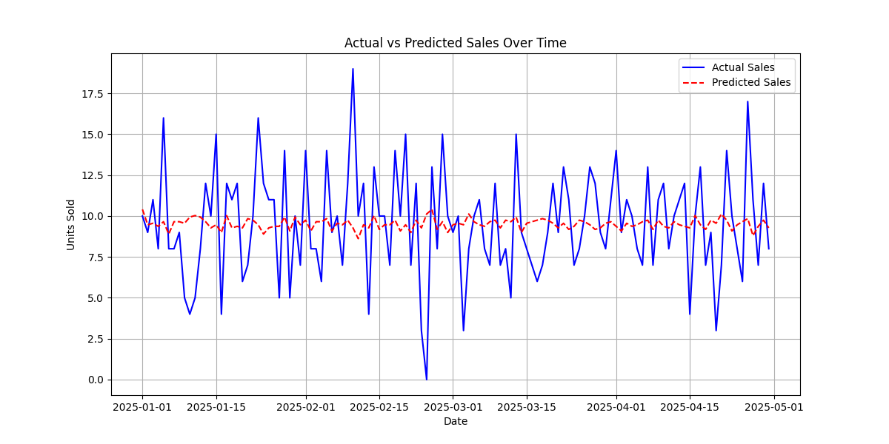

# Sales Forecasting AI 📊🤖

An end-to-end AI/ML project demonstrating data preprocessing, model training, prediction, and visualization.  
This project forecasts sales based on advertising spend using a simple linear regression model.

---

## 📌 Project Overview
- **Goal:** Predict sales revenue based on TV, radio, and newspaper advertising budgets.
- **Dataset:** Synthetic sales dataset generated with Python (`sales_sample.csv`).
- **Approach:** End-to-end ML pipeline with Pandas, NumPy, scikit-learn, and Matplotlib.
- **Outcome:** Model predicts sales and visualizes actual vs. predicted results.

---

## ⚙️ Tech Stack
- **Language:** Python 3.10  
- **Libraries:** Pandas, NumPy, scikit-learn, Matplotlib  
- **Environment:** Virtualenv + VS Code  
- **Version Control:** Git & GitHub  

---

## 🚀 Workflow
1. **Data Generation** → Created synthetic sales dataset (`data_gen.py`).  
2. **Exploration** → Analyzed dataset with Pandas (`explore.py`).  
3. **Model Training** → Linear Regression with scikit-learn (`train_linear.py`).  
4. **Prediction** → Predict sales from ad spend (`predict.py`).  
5. **Visualization** → Compare actual vs predicted sales (`visualize.py`).  

---

## 📊 Results
- Blue line → Actual Sales  
- Red dashed line → Predicted Sales  



---

## 🔧 How to Run
Clone this repository and run locally:

```bash
# Clone repo
git clone https://github.com/shreerang14/sales-forecasting-ai.git
cd sales-forecasting-ai

# Create virtual environment
python -m venv venv
.\venv\Scripts\activate   # On Windows

# Install dependencies
pip install -r requirements.txt

# Generate data
python data_gen.py

# Train model
python train_linear.py

# Predict new values
python predict.py

# Visualize results
python visualize.py
